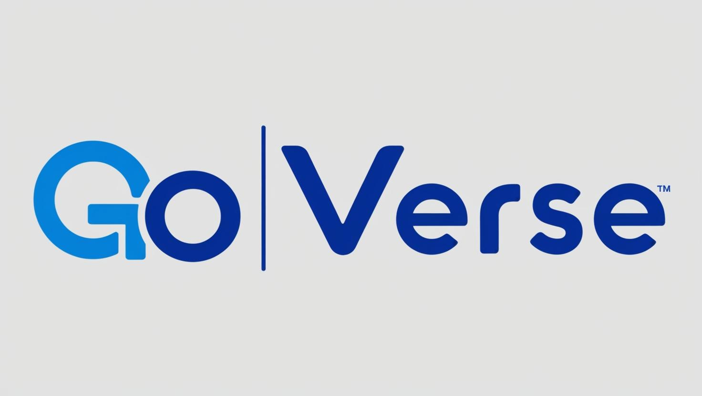

# GoVerse - A Social Networking Application

GoVerse is a robust social networking platform built with Go, offering a rich set of features for user interaction and content sharing.

## Features

- **User Management**
    - Account creation and authentication
    - Email verification system
    - Profile customization with avatar images
    - Account suspension and deletion

- **Social Interactions**
    - Friend requests and connections
    - Post creation with text, images, and videos
    - Comments and likes on posts

- **Media Handling**
    - Image upload support (JPG, PNG, GIF, WebP)
    - Video upload support (MP4, MOV, AVI, WMV, MKV)
    - Automatic file validation and storage

## Tech Stack

- **Backend:** Go with Gin framework
- **Database:** PostgreSQL
- **Storage:** Local file system
- **Email:** MailHog for development
- **Containerization:** Docker and Docker Compose
- **Messaging Queue:** RabbitMQ for asynchronous task processing and message handling

## Getting Started

### Prerequisites

- Docker
- Docker Compose
- Rabbitqm

### Installation

1. Clone the repository:
```bash
git clone https://github.com/Franklyn-Sancho/GoVerse.git
cd goverse
```

2. Start the application:
```bash
docker-compose up -d
```

3. Access the application at `http://localhost:8080`

## API Documentation

### Authentication Endpoints
- `POST /register` - Create new user account
- `POST /login` - User login
- `POST /logout` - User logout
- `GET /confirm-email` - Email verification

### User Endpoints
- `GET /users/:id` - Get user profile
- `DELETE /users/:id` - Delete user account
- `PUT /users/:id/suspend` - Suspend user account

### Post Endpoints
- `POST /posts` - Create new post
- `GET /posts/:id` - Get post details
- `DELETE /posts/:id` - Delete post
- `PUT /posts/:id` - Update post

### Friend Endpoints
- `POST /friends/request` - Send friend request
- `PUT /friends/:id/accept` - Accept friend request
- `PUT /friends/:id/decline` - Decline friend request

## Environment Variables

Create a `.env` file with:
```
JWT_SECRET_KEY=your_secret_key
DB_HOST=postgres
DB_PORT=5432
DB_USER=postgres
DB_PASSWORD=your_password
DB_NAME=goverse
```

## Contributing

1. Fork the repository
2. Create your feature branch (`git checkout -b feature/amazing-feature`)
3. Commit your changes (`git commit -m 'Add amazing feature'`)
4. Push to the branch (`git push origin feature/amazing-feature`)
5. Open a Pull Request

## License

This project is licensed under the MIT License - see the [LICENSE](LICENSE) file for details.

## Contact

Project Link: [https://github.com/Franklyn-Sancho/GoVerse.git](https://github.com/Franklyn-Sancho/GoVerse.git)


